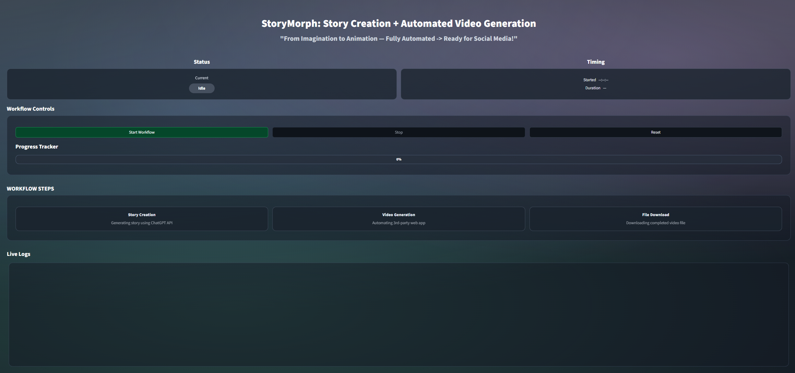
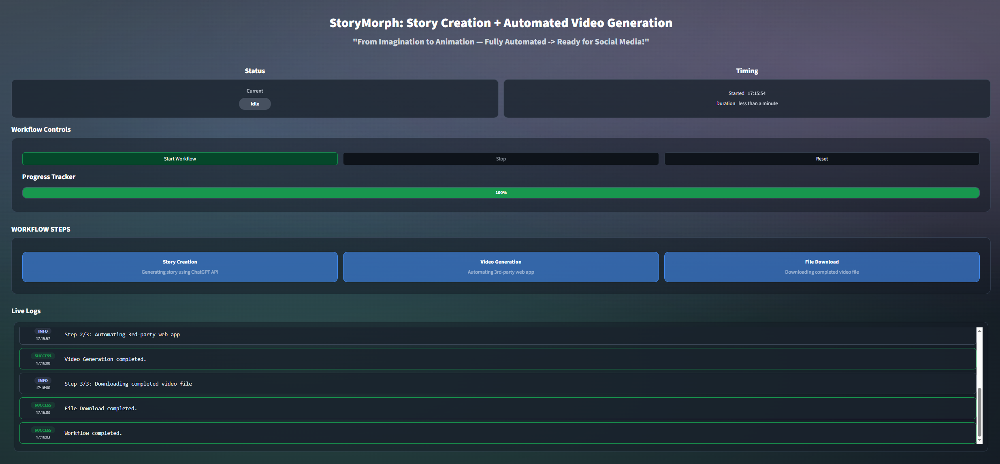

# 🎬 Automated Video Creation GUI

A sleek Streamlit dashboard to **monitor and control** an automated pipeline for story creation and video generation. It includes state-aware buttons, a progress tracker, step cards, and live logs with auto-scroll — all wrapped in a modern, dark, pastel gradient UI.

---

## 💻 Screenshots





---

## 🧰 Features

- **Status & Timing** panels with badges (Idle / Running / Error)
- **Workflow controls**: Start / Stop / Reset with disabled-state colors
- **Progress tracker** with smooth updates
- **Step cards** (Story Creation → Video Generation → File Download)
- **Live logs** styled as cards with level pills and timestamps (auto-scroll)
- **Design knobs** via CSS variables (tweak button height, padding, colors)
- **Optional subtle page shell** you can toggle with a single variable

---

## 📦 Dependencies

> (Keeping your original commands exactly as-is)

```bash
py -m pip install -U streamlit
```

### Optional (enables per-button coloring)

```bash
py -m pip install -U streamlit-extras
```

> Uses `streamlit_extras.stylable_container` for the Start/Stop/Reset button styles.  
> Without it, the app still runs with default Streamlit buttons.

---

## ▶️ Run

> (Keeping your original run command)

```bash
streamlit run streamlit_gui.py
```

**Tip:** If your file is named `app.py`, you can also run `streamlit run app.py`.

---

## 🗂️ Suggested Project Structure

```
.
├── streamlit_gui.py      # Main Streamlit app
├── README.md             # This file
└── requirements.txt      # Optional: streamlit, streamlit-extras
```

Example `requirements.txt`:

```
streamlit>=1.36
streamlit-extras>=0.4.0
```

Install with:

```bash
py -m pip install -r requirements.txt
```

---

## 🎨 Quick Customization (CSS Knobs)

Tweak these variables in the app’s CSS block:

```css
:root{
  /* Page shell (outer frame) */
  --shell-bg: rgba(20,26,36,0.00);
  --shell-br: rgba(85,102,130,0.00);
  --shell-radius: 16px;
  --shell-pad: 0px;

  /* Buttons */
  --btn-height: 53px;
  --btn-font: 16px;
  --btn-radius: 17px;
  --btn-hpad: 18px;

  /* Progress bar */
  --pb-height: 35px;
  --pb-radius: 13px;
  --pb-font: 14px;

  /* Step states */
  --step-done-bg: rgba(64,137,238,.62);
  --step-done-br: rgb(64,137,238);
  --step-error-bg: rgba(200,60,60,0.60);
  --step-error-br: rgb(200,60,60);

  /* Group boxes */
  --group-pad-y: 28px;
  --group-pad-x: 32px;
  --group-bottom-extra: 8px;
}
```

- Taller buttons? Change `--btn-height`.
- More breathing room in group boxes? Adjust `--group-pad-y` / `--group-pad-x`.
- Turn the outer shell **on**: set `--shell-bg` to something like `rgba(20,26,36,0.35)`.

---

## 🧪 Troubleshooting

- **Buttons don’t resize** — Ensure `streamlit-extras` is installed and the `stylable_container` IDs match the CSS selectors.
- **Rounded corners on logs are clipped** — Increase the iframe height, e.g. `st_html(logs_html, height=440, scrolling=False)`, or reduce the internal `.lg-scroll` height to leave bottom padding.
- **Outer shell still visible** — Confirm `--shell-bg` and `--shell-br` are fully transparent and that `#page-shell-anchor` exists in the page.

---

## 🔒 License — Proprietary & Confidential (All Rights Reserved)

This repository is distributed with a **strict proprietary license**. See the [LICENSE](LICENSE) file for full terms.
